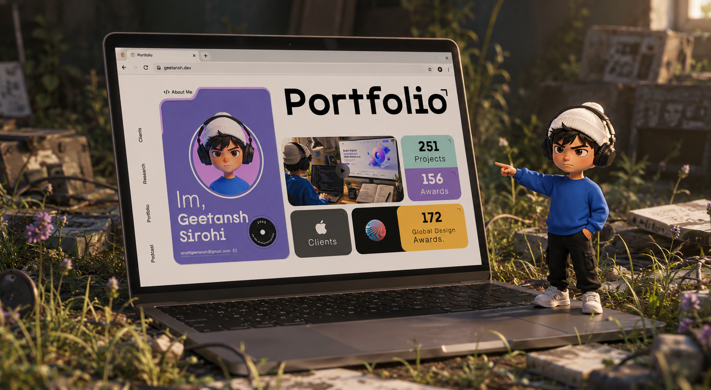

#  GRID Portfolio — Interactive Portfolio Landing Page
 
A modern, visually interactive portfolio landing page built using **only HTML & CSS — no JavaScript.**  
Created as part of **Sheryians Coding School, Cohort 3.0** assignment.
 
---
 
## 🌐 Live Demo
 
[View Live Project →](https://grid-portfolio-beta.vercel.app/)
 
---
 
## 📸 Preview
 

 
---
 
## 🚀 What I Built
 
The assignment was to replicate a reference portfolio design using CSS Grid.
 
I went beyond that — rebuilt the visual feel independently, engineered a **Bento-style grid layout**, added hover interactions, responsive design, and a creative hero section workaround. All in pure HTML & CSS, zero JavaScript.
 
---
 
## ✨ Features
 
- **Modern Bento/Grid-based layout** — card-based composition with intentional visual hierarchy
- **Heavy use of CSS Grid & Flexbox** — no frameworks, no shortcuts
- **Interactive hover effects** with smooth CSS transitions throughout
- **Creative hero section** — custom image technique to simulate SVG-like curves without using SVG
- **Fully responsive** — Desktop, Tablet, and Mobile
- **Clean, professional visual hierarchy** — typography, spacing, and color done intentionally
- **Lightweight & fast-loading** — zero dependencies, zero JavaScript
- **Easy to customize** — clean class structure for personal branding
---
 
## ⚠️ Real Challenges I Faced
 
**1. No SVG knowledge yet**
The reference used SVG curves in the hero. I used a background-removed image + CSS positioning to simulate the same effect — and it worked.
 
**2. CSS Grid from scratch**
`grid-template-areas`, `grid-column`, `grid-row` — all new. Took multiple full rebuilds before the layout held properly.
 
**3. Responsive design — self-taught**
Media queries weren't in the curriculum yet. I applied them independently. Getting the Bento grid to reflow cleanly on mobile took real iteration.
 
**4. Visual hierarchy breaking on smaller screens**
What looked clean on desktop collapsed on mobile. Fixed it breakpoint by breakpoint, manually.
 
---
 
## 📚 What I Learned
 
- CSS Grid is powerful — but only clicks when you build with it, not just read about it
- Planning layout structure before writing code is not optional
- Responsive design is hard — solving it without tutorials made it stick
- Constraints force better creative thinking
---
 
## 🛠 Tech Used
 
`HTML5` &nbsp; `CSS3` &nbsp; `CSS Grid` &nbsp; `Flexbox` &nbsp; `Responsive Design` &nbsp; `Hover Animations`
 
---
 
## 📂 How to Run
 
No installation required.  
Download the ZIP → Extract → Open `index.html` in your browser. Done.
 
---
 
## 🌐 Connect With Me
 
[GitHub](https://github.com/geetansh-sirohi) · [Instagram](https://www.instagram.com/code.with.geetansh/) · [LinkedIn](https://www.linkedin.com/in/geetansh-sirohi/)
 
*---------------------------------------*
